# Introduction

[ComPDFKit](https://www.compdf.com/) PDF SDK for Windows is a robust PDF library for developers who need to develop applications on Windows, which offers powerful .Net APIs for quickly viewing, annotating, editing, and creating PDFs. It is feature-rich and battle-tested, making PDF files process and manipulation easier and faster for Windows devices.

[ComPDFKit API](https://api.compdf.com/api/pricing) allows you to get 1000 files processing monthly now! Just [sign up](https://api.compdf.com/signup) for a free trial and enjoy comprehensive PDF functions.

# Related

- [ComPDFKit PDF Library for Android](https://github.com/ComPDFKit/PDF-SDK-Android)
- ComPDFKit PDF SDK - [Flutter Library](https://pub.dev/packages/compdfkit_flutter)
- ComPDFKit PDF SDK - [React Native Library](https://www.compdf.com/react-native)
- [How to Build an iOS PDF Viewer or Editor in Objective-C](https://www.compdf.com/blog/build-an-ios-pdf-viewer-or-editor-in-objective-c)
- [How to Build an iOS PDF Viewer or Editor in Swift](https://www.compdf.com/blog/build-an-ios-pdf-viewer-or-editor-in-swift)

# Get Started

It is easy to embed ComPDFKit PDF SDK in your Windows application with a few lines of C# code. Take just a few minutes and get started.

The following sections introduce the requirements, structure of the installation package, and how to make a Windows PDF Reader in C# with ComPDFKit PDF SDK.


## Requirements

- Windows 7, 8, 10, and 11 (32-bit and 64-bit).
- Visual Studio 2017 or higher (Make sure the **.NET Desktop Development** is installed).
- .NET Framework 4.5 or higher.


## Windows Package Structure

You can [contact us](https://www.compdf.com/contact-us) and access our PDF SDK installation package. The SDK package includes the following files.

- ***"Examples"*** - A folder containing Windows sample projects.
    - ***"Viewer"*** - A basic PDF viewer, including reading PDFs, changing themes, bookmarks, searching text, etc.
    - ***"Annotations"*** - A PDF viewer with full types of annotation editing, including adding annotations, modifying annotations,  annotation lists, etc.
    - ***"ContentEditor"*** - A PDF viewer with text and image editing, including modifying text, replacing images, etc.
    - ***"Forms"*** - A PDF viewer with full types of forms editing, including radio button, combo box, etc.
    - ***"DocsEditor"*** - A PDF viewer with page editing, including inserting/deleting pages, extracting pages, reordering pages, etc.
    - ***"PDFViewer"*** - A multi-functional PDF program that integrates all of the above features.
    - ***"ComPDFKit_Tools"*** - A default control library for quickly building various function modules of PDF viewer.
    - ***"license_key_win.xml"*** - A xml file containing key and secret.
    - ***"TestFile"*** - A folder containing test files.
    - ***"Samples"*** - -A folder containing console application.
- ***"lib"*** - Include the ComPDFKit dynamic library (x86,x64).
- ***"nuget"*** - Include the ComPDFKit.NetFramework nuget package file.
- ***"api_reference_windows.chm"*** - API reference.
- ***"developer_guide_windows.pdf"*** - Developer guide.
- ***"legal.txt"*** - Legal and copyright information.
- ***"release_notes.txt"*** - Release information.

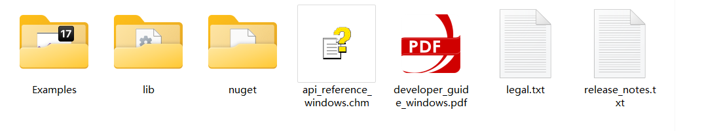


## How to Run a Demo
ComPDFKit PDF SDK for Windows provides multiple demos in C# for developers to learn how to call the SDK on Windows. You can find them in the ***"Examples"*** folder.

In this guide, we take ***"PDFViewer"*** as an example to show how to run it in Visual Studio 2022.

1. Copy your ***"license_key_windows.txt"*** to the ***"Examples"*** folder (The file is the license to make your project run).

2. Find ***"Examples.sln"*** in the ***"Examples"*** folder and open it in Visual Studio 2022.

   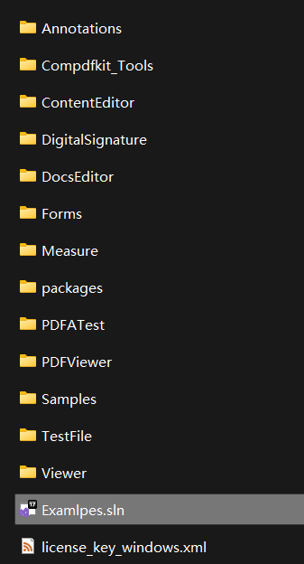

3. Select ***"PDFViewer"*** and right-click to set it as a startup project.

   

4. Run the project and then you can open the multifunctional ***"PDFViewer"*** demo.

   

**Note:** *This is a demo project, presenting completed ComPDFKit PDF SDK functions. The functions might be different based on the license you have purchased. Please check that the functions you choose work fine in this demo project.*


## How to Make a Windows Program in C# with ComPDFKit PDF SDK

### Create a New Project

1. Fire up Visual Studio 2022, click **Create a new project**.

   

2. Choose **WPF App (.NET Framework)** and click **Next**.

   

3. Configure your project: Set your project name and choose the location to store your program. The project name is called "ComPDFKit Demo" in this example. This sample project uses .NET Framework 4.6.1 as the programming framework.
   

4. Click the **Create** button. Then, the new project will be created.


### Add ComPDFKit to Your Project

There are two ways to add ComPDFKit to your Project: `Nuget Repository` and `Local Package`, you can choose one or the other according to your needs.

**Nuget Repository**

1. Open your project’s solution, and in the Solution Explorer, right-click on **References** and click on the menu item **Manage NuGet Packages…**. This will open the NuGet Package Manager for your solution.

   

2. Search for `ComPDFKit.NetFramework`, and you’ll find the package on [nuget.org](https://www.nuget.org/packages/ComPDFKit.NetFramework/).

3. On the right side, in the panel describing the package, click on the **Install** button to install the package.

   

4. Once that is complete, you’ll see a reference to the package in the Solution Explorer under **References**.

   


**Local Package**

Rather than targeting a package held at [nuget.org](https://nuget.org/), you may set up a configuration to point to a local package. This can be useful for some situations, for example, your build machines don’t have access to the internet.

1. You can find ***"ComPDFKit.NetFramework....nupkg"*** file in the SDK Package

2. Create or edit a ***"nuget.config"*** file in the same directory as your solution file (e.g. ***"ComPDFKit Demo.sln"***).

   

   The contents of the file should contain an XML element, `packageSources` — which describes where to find NuGet packages — as a child of a root node named `configuration`. If the file already exists, add the extra `packageSources` entry shown below. If the file is blank, copy and paste the entirety of the following contents:

   ```xml
   <?xml version="1.0" encoding="utf-8"?>
   <configuration>
   	<packageSources>
   		<add key="ComPDFKitSource" value="path\to\directoryContainingNupkg" />
   	</packageSources>
   </configuration>
   ```

   Edit the `value` of the contents to correctly refer to the location of the directory containing the ***"ComPDFKit.NetFramework....nupkg"*** package — for example, `C:\Users\me\nugetPackages\`. Now save the file, and close and reopen your solution for Visual Studio to force a read of the NuGet configuration.

3. Open your project’s solution, and in the Solution Explorer, right-click on **References** and click on the menu item **Manage NuGet Packages…**. This will open the NuGet Package Manager for your solution.

   

4. On the right-hand side of the manager in the Package source dropdown window, choose the entry `ComPDFKitSource` (or whatever you decided to name it). You should then see the entry for ***"ComPDFKit.NetFramework"***.

   

5. On the right side, in the panel describing the package, click on the **Install** button to install the package.

   

6. Once that’s complete, you’ll see a reference to the package in the Solution Explorer under **References**.

   


Alternatively, you can manually integrate ComPDFKit's dynamic libraries into your project.

1. Open the ComPDFKit SDK package that you have extracted, and go to the ***"lib"*** folder. Copy the ***"x64"*** folder, ***"x86"*** folder, ***"ComPDFKit.Desk.dll"*** file, and ***"ComPDFKit.Viewer.dll"*** file to the folder with the same name as your project that you created in  2.4.1. In this project, the folder is named "ComPDFKit Demo". Now, your folder should look like this:

   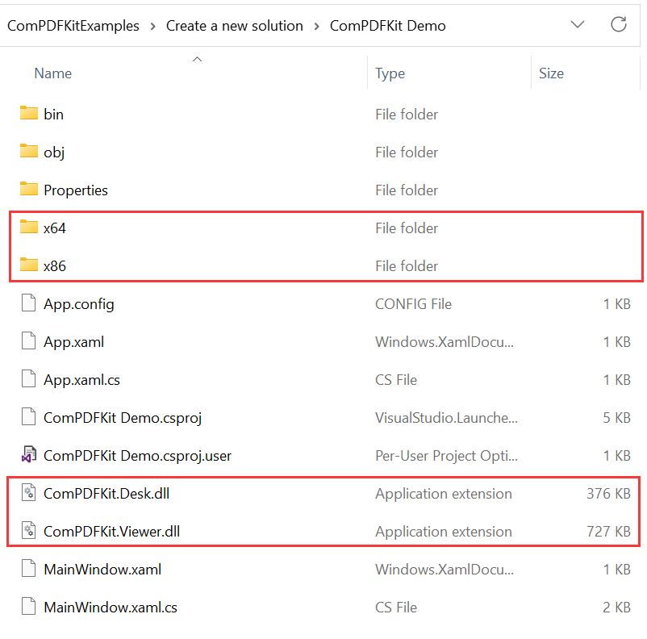

2. Then click the button **Show All Files** in the **Solution Explorer** menu. Find and right click the files you added before, and choose **Include In Project**.

   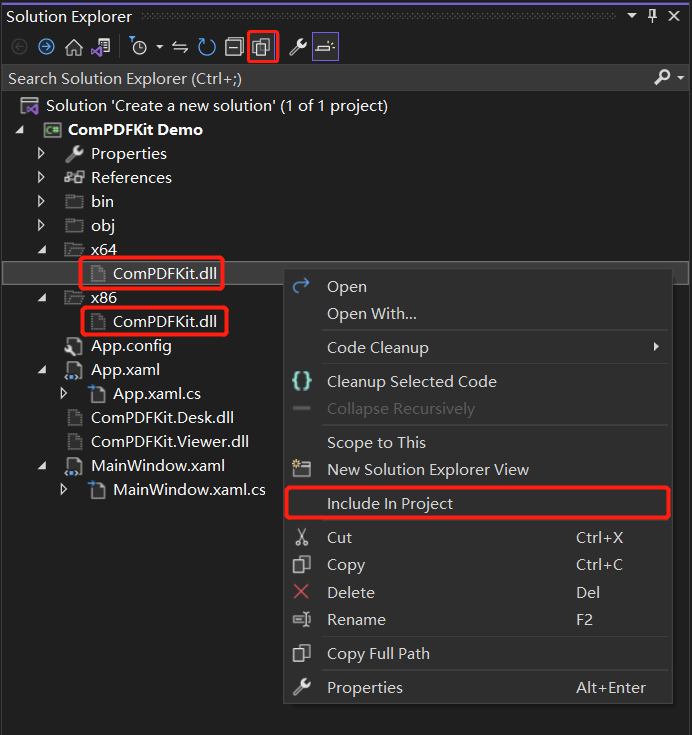

   Now the structure of your project will look like this:

   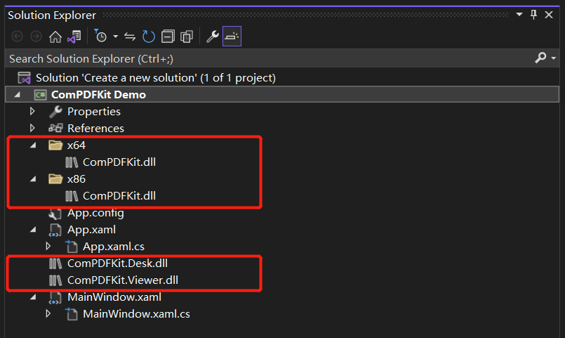

3. To use the APIs of ComPDFKit PDF SDK in your project, follow the instructions and add them to **Reference**. Right click the project that you need to add ComPDFKit PDF SDK and click **Add**. Then, click **Reference**.

   

   In the Reference dialog, choose **Browse**, click another **Browse** button in the bottom right corner, and navigate to the ***"ComPDFKit Demo"*** folder which is in your project. Select ***"ComPDFKit.Desk.dll"*** and ***"ComPDFKit.Viewer.dll"*** dynamic library. Then, click **OK**.

   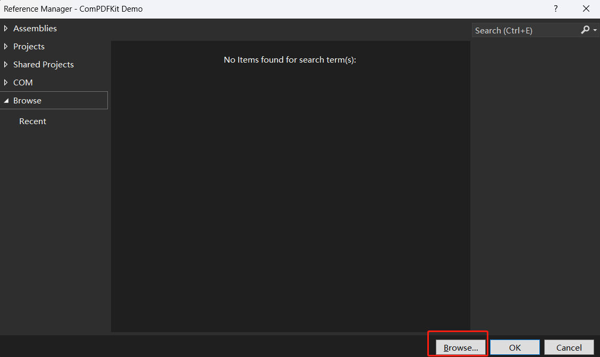

   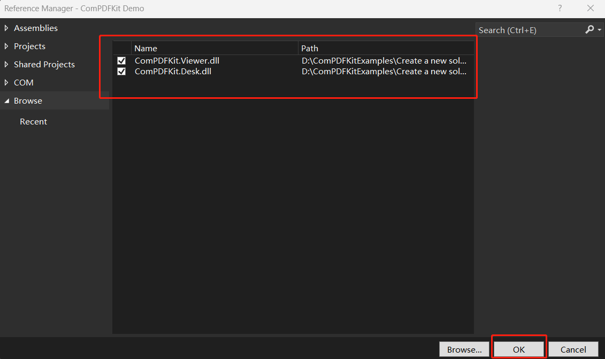

   Right click ***"ComPDFKit.dll"*** -> click **Properties**.

   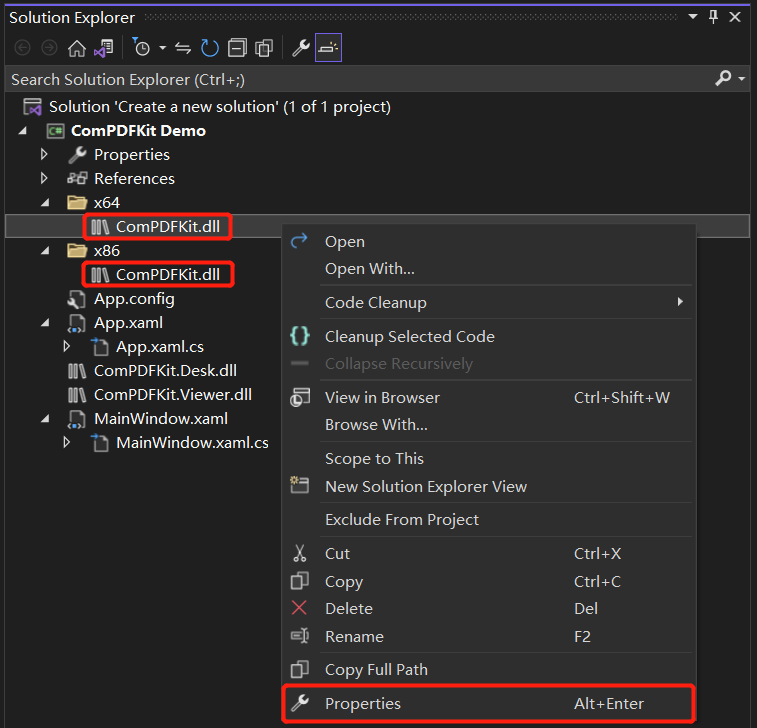

   Please make sure to set the property **Copy to Output Directory** of ***"ComPDFKit.dll"*** to **Copy if newer**. Otherwise, you should copy it to the same folder with the executable file manually before running the project.

​       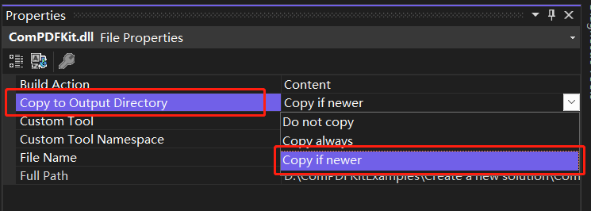


### Apply the License Key

You can [contact](https://www.compdf.com/contact-us) ComPDFKit team to get a trial license. Before using any ComPDFKit PDF SDK classes, a required operation is to set the license key. Add the following method — `LicenseVerify()` to ***“MainWindow.xaml.cs”***.

```c#
bool LicenseVerify()
{
    if (!CPDFSDKVerifier.LoadNativeLibrary())
        return false;

    LicenseErrorCode verifyResult = CPDFSDKVerifier.LicenseVerify("license_key_windows.txt", true);
    return (verifyResult == LicenseErrorCode.E_LICENSE_SUCCESS);
}
```


### Display a PDF Document

We have finished all prepare steps. Let's display a PDF file.

Add the following code to ***“MainWindow.xaml”*** and ***“MainWindow.xaml.cs”*** to display a PDF document. Please make sure to replace "ComPDFKit_Demo" with the name of your project. Now, all you need to do is to create a `CPDFViewer` object, and then display the `CPDFViewer` object in the Grid (component) named “PDFGrid” using the `OpenPDF_Click` method.

Now your ***"MainWindow.xaml"*** should look like the following code.

```c#
<Window x:Class="ComPDFKit_Demo.MainWindow"
        xmlns="http://schemas.microsoft.com/winfx/2006/xaml/presentation"
        xmlns:x="http://schemas.microsoft.com/winfx/2006/xaml"
        xmlns:d="http://schemas.microsoft.com/expression/blend/2008"
        xmlns:mc="http://schemas.openxmlformats.org/markup-compatibility/2006"
        xmlns:local="clr-namespace:ComPDFKit_Demo"
        mc:Ignorable="d"
        Title="MainWindow" Height="450" Width="800" UseLayoutRounding="True">
    <Grid>
        <Grid.RowDefinitions>
            <RowDefinition Height="*"/>
            <RowDefinition Height="52"/>
        </Grid.RowDefinitions>
        <Grid Name="PDFGrid" Grid.Row="0" />
        <Button Content="Open PDF" Grid.Row="1" HorizontalAlignment="Left" Margin="10" Click="OpenPDF_Click"/>
    </Grid>
</Window>
```

Now your ***“MainWindow.xaml.cs”*** should look like the following code. Please note: You need to enter your license key. All the places that need to be modified in the code have been marked with comments in the code below. You just need to replace the string content below the comments by yourself.

```c#
using ComPDFKit.NativeMethod;
using ComPDFKit.PDFDocument;
using ComPDFKitViewer.PdfViewer;
using Microsoft.Win32;
using System.Windows;

namespace ComPDFKit_Demo
{
	public partial class MainWindow : Window
    {
        public MainWindow()
        {
            InitializeComponent();
            LicenseVerify();
        }
        
        bool LicenseVerify()
        {
            if (!CPDFSDKVerifier.LoadNativeLibrary())
        		return false;

    		LicenseErrorCode verifyResult = CPDFSDKVerifier.LicenseVerify("license_key_windows.txt", true);
    		return (verifyResult == LicenseErrorCode.E_LICENSE_SUCCESS);
        }

        private void OpenPDF_Click(object sender, RoutedEventArgs e)
        {
            // Get the path of a PDF file.
            var dlg = new OpenFileDialog();
            dlg.Filter = "PDF Files (*.pdf)|*.pdf";
            if (dlg.ShowDialog() == true)
            {
                // Use the PDF file path to open the document in CPDFViewer.
                CPDFViewer pdfViewer = new CPDFViewer();
                pdfViewer.InitDocument(dlg.FileName);
                if (pdfViewer.Document != null &&
                    pdfViewer.Document.ErrorType == CPDFDocumentError.CPDFDocumentErrorSuccess)
                {
                    pdfViewer.Load();
                    PDFGrid.Children.Add(pdfViewer);
                }
            }
        }
    }
}
```

Now run the project and you will see the PDF file that you want to display.  The PDF Viewer has been created successfully.


### Troubleshooting

1. If "System.IO.FileNotFoundException" occurred in the `LicenseVerify()` function like this:

   

   Check your WPF project and ensure that you chose **WPF App(.NET Framework)** instead of **WPF Application** when creating the project.

   

2. Other Problems

   If you meet some other problems when integrating our ComPDFKit PDF SDK for Windows, feel free to contact [ComPDFKit team](https://www.compdf.com/contact-us).


## UI Customization
The folder of ***“ComPDFKit_Tools”*** includes the UI components to help conveniently integrate ComPDFKit PDF SDK. We have also built six standalone function programs, namely **Viewer**, **Annotations**, **ContentEditor**, **Forms**, **DocsEditor**, and **Digital Signature**, using this UI component library. Additionally, we have developed a program called **PDFViewer** that integrates all the above-mentioned example features for reference.


In this section, we will introduce how to use it from the following parts:

1. Overview of ***"ComPDFKit_Tools"*** Folder: Show the folder structure and the main features included in the corresponding component.
2. UI Components: Introduce the UI components and how to use them easily and fast.


### Overview of ***"ComPDFKit_Tools"*** Folder
There are seven modules in ***"ComPDFKit_Tools"***: ***"Common"***, ***"Viewer"***, ***"Annotations"***, ***"ContentEditor"***, ***"Forms"***, ***"DocsEditor"***, and ***"Digital Signatures"***. Each of them includes the code and UI components like the following table to process PDFs.

<table>
  <tr>
    <th>Folder</th>
    <th>SubFolder</th>
    <th>Description</th>
  </tr><tr>
    <td rowspan="5"> Common</td>
    <td> BaseControl</td>
    <td> Basic components used to compose other components, such as the value component to control the value of opacity, font size, border width, etc.</td>
  </tr><tr> 
    <td> Convert</td>
    <td> Data converter</td>
  </tr><tr> 
    <td> Helper</td>
    <td> Static classes and static methods that provide assistance for common functions, such as a static method that can invoke a file open dialog and get the selected PDF file path: GetFilePathOrEmpty.</td>
  </tr><tr> 
    <td> PasswordControl</td>
    <td> Include the UI components and interaction of typing file passwords.</td>
  </tr> <tr> 
    <td> PropertyControl</td>
    <td> Include the UI components and interaction of handling specified data type inputting.</td>
  </tr><tr>
    <td rowspan="6"> PDFView</td>
    <td> PDFBookmark</td>
    <td> Include the UI components and interaction of editing bookmarks and jumping pages.</td>
  </tr><tr> 
    <td> PDFInfo</td>
    <td> Include the UI components and interaction of document information.</td>
  </tr> <tr> 
    <td> PDFDisplaySettings</td>
    <td> Include the UI components and interaction of PDF viewing like setting  themes, display modes, etc.</td>
  </tr><tr> 
    <td> PDFOutline</td>
    <td> Include the UI components and interaction of jumping and displaying the PDF outline.</td>
  </tr><tr> 
    <td> PDFSearch</td>
    <td> Include the UI component and interaction for searching PDFs and generating the search list. </td>
  </tr><tr> 
    <td> PDFThumbnail</td>
    <td> Include the UI component and interaction of PDF thumbnails. </td>
    </tr><tr>
  <td rowspan="3">Annotations</td>
  <td>PDFAnnotationBar</td>
  <td>Include the toolbar that indicates the required annotation type and order. Clicking on the navigation bar will pass the corresponding comment type enumeration through an event.</td>
</tr><tr>
  <td>PDFAnnotationPanel</td>
  <td>When creating or modifying annotations, specific property panels are displayed, and controls for handling data are provided.</td>
</tr><tr>
  <td>PDFAnnotationList</td>
  <td>Include the UI component and interaction of displaying all annotations in a list, selecting and deleting specific annotations/all annotations.</td>
</tr><tr>
  <td rowspan="2">ContentEditor	</td>
  <td>PDFImageEditControl</td>
  <td>Include the toolbar to edit PDF images and undo/redo the processing of editing PDF images.</td>
</tr><tr>
  <td>PDFTextEditControl</td>
  <td>Include the toolbar to edit PDF text and undo/redo the processing of editing PDF text.</td>
</tr><tr>
  <td rowspan="2">Forms</td>
  <td>FormBarControl</td>
  <td>Include the UI component and interaction of specifying needed form fields and the order of displaying the form field types in UI.</td>
</tr><tr>
  <td>FormPropertyControl</td>
  <td>Include the property panel and interaction to set the properties of forms.</td>
</tr><tr>
  <td rowspan="4">Docs Editor</td>
  <td>PDFPageEditBar</td>
  <td>Include the toolbar for creating, replacing, rotating, extracting, and deleting PDF pages</td>
</tr><tr>
  <td>PDFPageEdit</td>
  <td>Include the UI component and interaction of document editing like thumbnails, drag, right-click menu, etc.</td>
</tr><tr>
  <td>PDFPageExtract</td>
  <td>Include the popup window of page extraction. It only processes and transfers the data. You can refer to PDFPageEdit for inserting pages.</td>
</tr><tr>
  <td>PDFPageInsert</td>
  <td>Include the popup window of page insertion. It only processes and transfers the data. You can refer to PDFPageEdit for inserting pages.</td>
</tr>
<tr>
  <td rowspan="6">Digital Signatures</td>
  <td>AddCertificationDialog</td>
  <td>Include the popup window to create new certificates or using existing certificates.</td>
</tr>
<tr>
  <td>CPDFSignatureListControl</td>
  <td>Include the UI component and interaction of displaying the list of digital signatures and their status, with options to navigate to a specific signature location or open a signature status popup.</td>
</tr>
<tr>
  <td>VerifyDigitalSignatureControl</td>
  <td>Include the popup window to display the signature status.</td>
</tr>
<tr>
  <td>SignatureStatusBarControl</td>
  <td>Include the popup window to display all the signature statuses in this file. </td>
</tr>
<tr>
  <td>FillDigitalSignatureDialog</td>
  <td>Include the popup window to create the signature appearance.</td>
</tr>
<tr>
  <td>ViewCertificateDialog</td>
  <td>Include the popup window to view the signature certificates. </td>
</tr>
</table>


### UI Component

This section mainly introduces the connection between the UI components and API configuration of ***"ComPDFKit_Tools"***, which can not only help you quickly get started with the default UI but also help you view the associated API configuration. These UI components could be used and modified to create your customize UI.


**Part 1:**
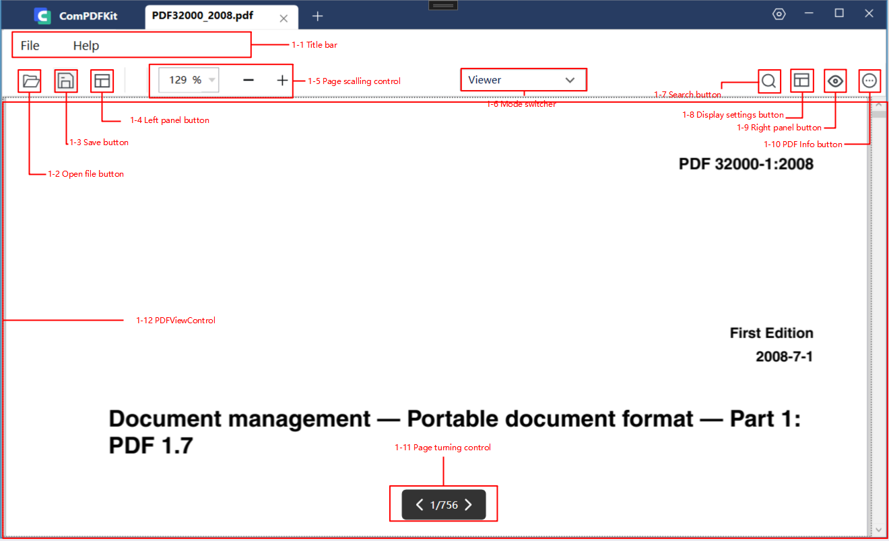

The picture above shows the main UI components associated with the API of Viewer, which are also the fundamental UI components of ***"ComPDFKit_Tools"***. The following table shows the details of the connection between UI components and APIs.

|Number|Name|Functionality|Description|
|------|-----------|-------------|-----------|
|1-1|Title bar|CPDFTitleBarControl|The toolbar at the top of the PDF view window: Include the help center and file center.|
|1-2|Open file button|/|Control to switch a new document.|
|1-3|Save button|/|Control to save the current file.|
|1-4|Right panel button|CPDFBOTABarControl|Control the display status of the property panel.|
|1-5|Page scalling control|CPDFScalingControl|Control to change the zoom ratio of PDF.|
|1-6|Mode switcher|/|Switch the feature modules.|
|1-7|Search button|CPDFBOTABarControl|Enter the searching mode.|
|1-8|Display settings button|CPDFDisplaySettingsControl|Control to show or hide the setting panel.|
|1-9|Left panel button|CPDFAnnotationControl、FromPropertyControl、PDFContentEditControl|Control the displaying status of property panel.|
|1-10|PDF info button|CPDFInfoControl|Control the popup window of document information.|
|1-11|Page turning control|PageNumberControl|Control to jump to other specific pages quickly.|
|1-12|PDFViewControl|PDFViewControl|Basic interactions like zooming PDF view with mouse and executing page jumping or push button actions.|


**Part 2:**

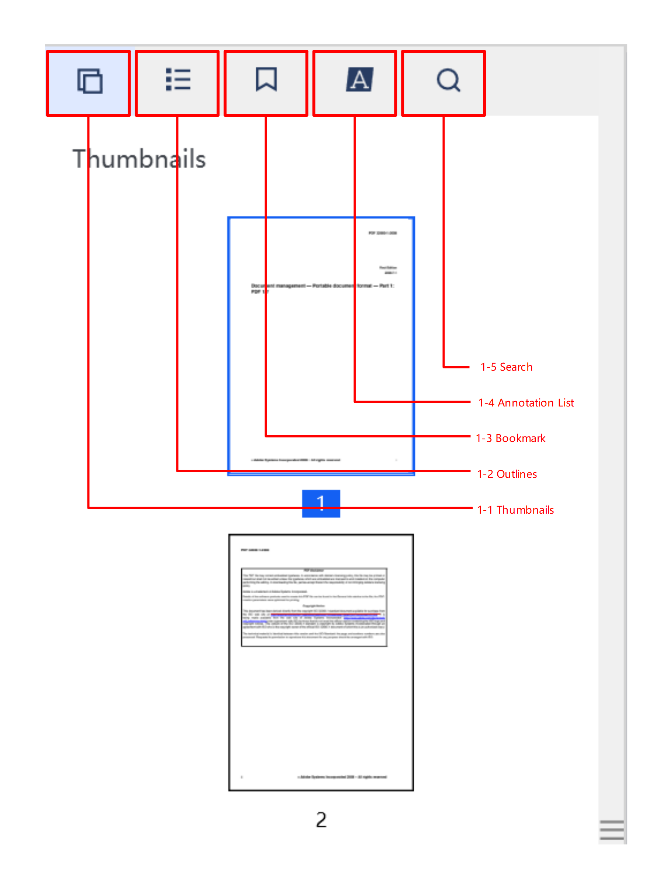

The picture above shows the UI components associated with the API of outline, bookmark, thumbnail, annotation list, and searching. The following table shows the details of the connection between UI components and APIs.

|Number|Name|Functionality|Description|
|------|-----------|-------------|-----------|
|1-1|Thumbnails|CPDFThumbnailControl|Enter the thumbnails of PDFs.|
|1-2|Outlines|CPDFOutlineControl|Enter the outlines of PDFs.|
|1-3|Bookmark|CPDFBookmarkControl|Enter the bookmark list of PDFs.|
|1-4|Annotation List|CPDFThumbnailControl|Enter the annotation list of PDFs.|
|1-5|Search|CPDFSearchControl|Enter the PDF keywords searching.|


**Part 3:**

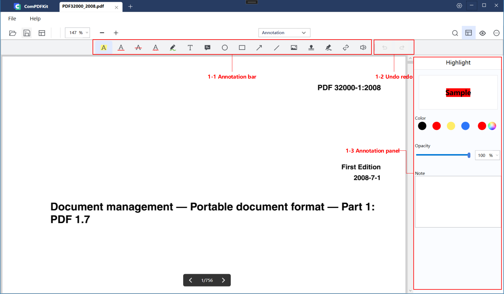

The picture above shows the UI components associated with the API of annotation. The following table shows the details of the connection between UI components and APIs.

|Number|Name|Functionality|Description|
|------|-----------|-------------|-----------|
|1-1|Annotation bar|CPDFAnnotationBarControl|Annotated toolbar, allowing specifying the annotation types and the order of displaying the annotation types in UI.|
|1-2|Undo redo|/|Undo/redo the processing of annotations.|
|1-3|Annotation panel|CPDFAnnotationControl|Preset annotation properties for creating annotation.|


**Part 4:**

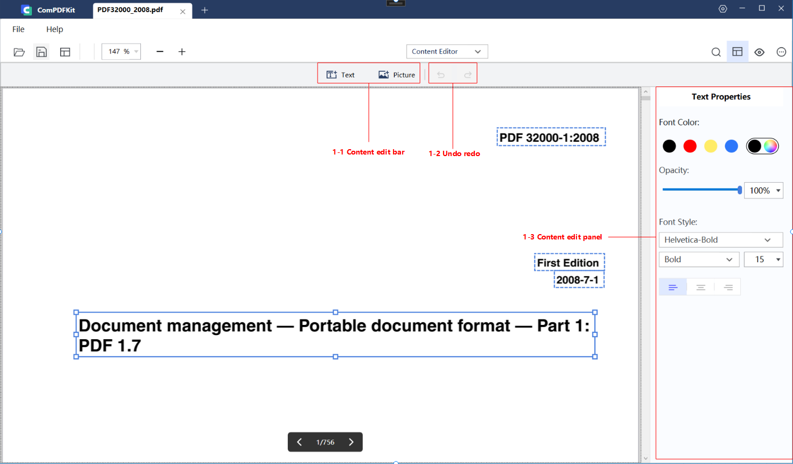

The picture above shows the UI components associated with the API of the content editor. The following table shows the details of the connection between UI components and APIs.

|Number|Name|Functionality|Description|
|------|-----------|-------------|-----------|
|1-1|Content edit bar|/|The tool bar of content editor. Enter a state of creating text and only text editing, after clicking on text editing. After clicking on image editing, you can add images. After adding the images, you will enter the default mode, in which both images and text can be edited.|
|1-2|Undo redo|/|Undo redo the processing of editing PDF text/images.|
|1-3|Content edit panel|PDFContentEditControl|Preset text properties for adding text. After clicking on text or image, you will get the attributes of the currently selected object and can modify them.|


**Part 5:**
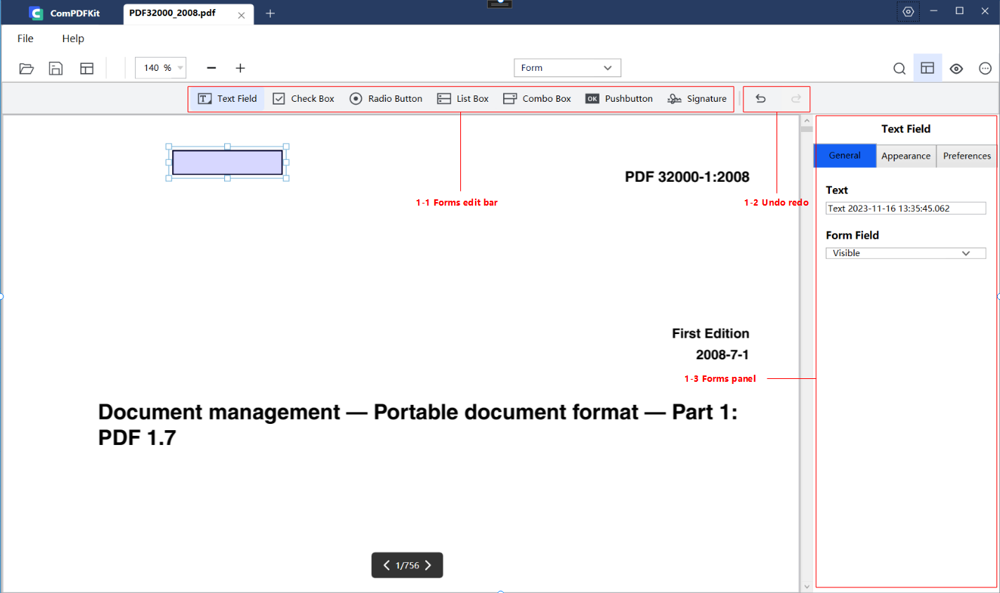
The picture above shows the UI components associated with the API of forms. The following table shows the details of the connection between UI components and APIs.

|Number|Name|Functionality|Description|
|------|-----------|-------------|-----------|
|1-1|Forms edit bar|CPDFFormBarControl|Tool bar of PDF forms.|
|1-2|Undo redo|/|Undo/redo the processing of forms.|
|1-3|Forms panel|FromPropertyControl|Set the properties of forms.|


**Part 6:**
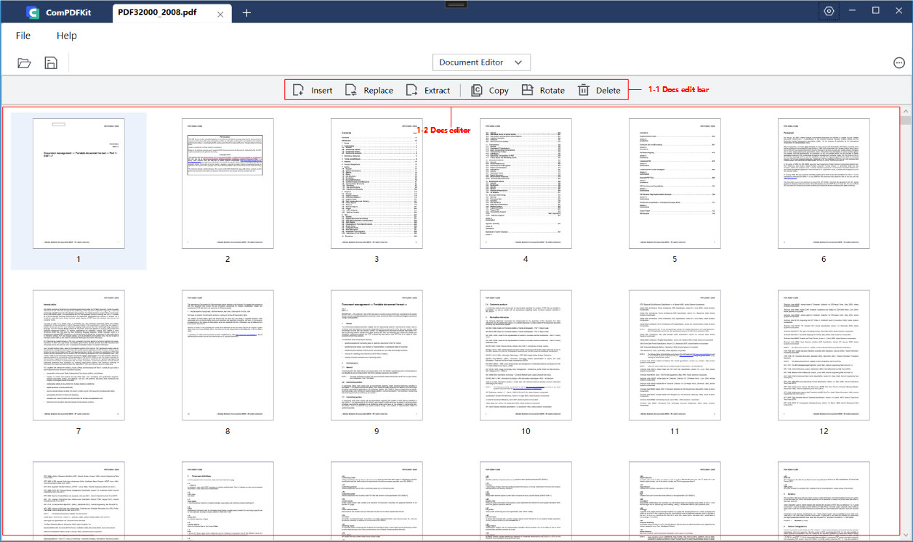

The picture above shows the UI components associated with the API of the document editor. The following table shows the details of the connection between UI components and APIs.

|Number|Name|Functionality|Description|
|------|-----------|-------------|-----------|
|1-1|Docs edit bar|CPDFPageEditBarControl、CPDFPageExtractWindow、CPDFPageInsertWindow|Tool bar of document editor.|
|1-2|Docs editor|CPDFPageEditControl|Show the thumbnails of PDF pages and interaction for editing PDF pages.|

**Part 7:**

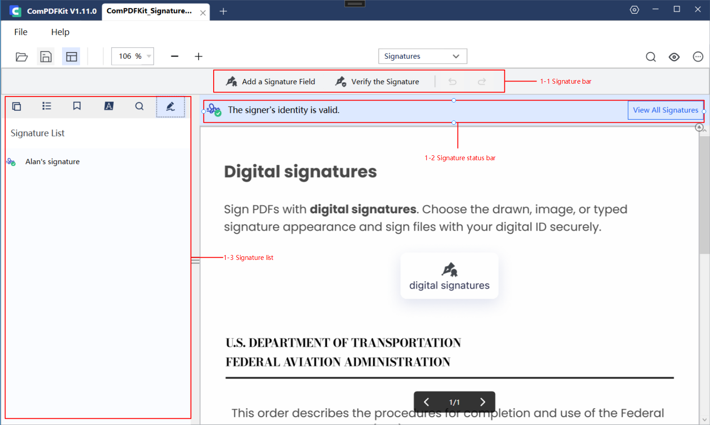

The picture above shows the UI components associated with the API of the digital signature. The following table shows the details of the connection between UI components and APIs.

|Number|Name|Functionality|Description|
|------|-----------|-------------|-----------|
|1-1|Signature bar|AddCertificationDialog、FillDigitalSignatureDialog| Add signature field, and verify all the signatures. |
|1-2|Signature status bar|SignatureStatusBarControl|Show the status of all the digital signatures.|
|1-3|Signature list|ViewCertificateDialog| A list to display all the digital signatures in PDFs.  |

# Samples

The Samples use preset parameters and documentation to call the API of ComPDFKit PDF SDK for each function without UI interaction or parameter settings. This is achieved through modular code examples. The functions include creating, getting, and deleting various types of annotations and forms, extracting text and images, encrypting and decrypting documents, adding watermarks and bates numbers, and more.

These projects not only demonstrate the best practices for each function but also provide detailed introductions. The impact of each function on PDF documents can be observed in the output directory. With the help of the Samples, you can quickly learn how to use the functions you need and apply them to your projects.

You can get our [code examples for Windows](https://www.compdf.com/guides/pdf-sdk/windows/examples). To learn more about the ComPDFKit API, please visit our [API Reference](https://developers.compdf.com/guides/pdf-sdk/windows/api-reference/index).

|Name|Description|
|----|-----------|
|Bookmark|Create a new bookmark, and access the existing bookmark.|
|Outline|Create a new outline, and get existing outline information.|
|PDFToImage|Convert PDF pages to PNG.|
|TextSearch|Perform full-text search and highlight keywords.|
|Annotation| Print the annotation list information, set the annotations (including markup, note, ink, free text, circle, square, line, stamp, and sound annotations), and delete the annotations. |
|AnnotationImportExport|Export and import annotations with an xfdf file.|
|InteractiveForms| Print form list information, set up interactive forms  (including text, checkbox, radio button, button, list, combo boxes, signing and deleting forms), and fill out form information. |
|PDFPage| Manipulate PDF pages, including inserting, splitting, merging, rotating, and replacing, etc. |
|ImageExtract| Extract images from a PDF document. |
|DocumentInfo| Display the information of PDF files like the author, created time, etc. |
|Watermark| Create text/image watermarks and delete watermarks. |
|Background| Create a color/image background and delete the background. |
|Bates| Create and remove bates numbers. |
|PDFRedact| Create redaction to remove sensitive information or private data, which cannot be viewed and searched once applied. |
|Encrypt| Set passwords to encrypt PDFs and set document permissions. Allow decrypting PDFs. |
|PDFA| Convert PDF to PDF/A-1a and PDF/A-1b. |
|Flatten| Flatten PDF annotations and forms, and merge all layouts as one layout. |
|DocumentCompare| Compare different documents and show the result in new documents. |
| DigitalSignatures      | Create, fill, and verify the signatures and certificates. Read the details of signatures and certificates. Remove digital signatures. |

# Support

[ComPDFKit]((https://www.compdf.com)) has a professional R&D team that produces comprehensive technical documentation and guides to help developers. Also, you can get an immediate response when reporting your problems to our support team.

- For detailed information, please visit our [Guides](https://www.compdf.com/guides/pdf-sdk/windows/overview) page.

- Stay updated with the latest improvements through our [Changelog](https://www.compdf.com/pdf-sdk/changelog-windows).

- For technical assistance, please reach out to our [Technical Support](https://www.compdf.com/support).

- To get more details and an accurate quote, please contact our [Sales Team](https://compdf.com/contact-us).


# License

ComPDFKit PDF SDK supports flexible licensing options, please contact [our sales team](mailto:support@compdf.com) to know more. Each license is only valid for one application ID in development mode.  However, any documents, sample code, or source code distribution from the released package of ComPDFKit PDF SDK to any third party is prohibited.


# Note

We are glad to announce that you can register a ComPDFKit API account for a [free trial](https://api.compdf.com/api/pricing) to process 1000 documents per month for free.


