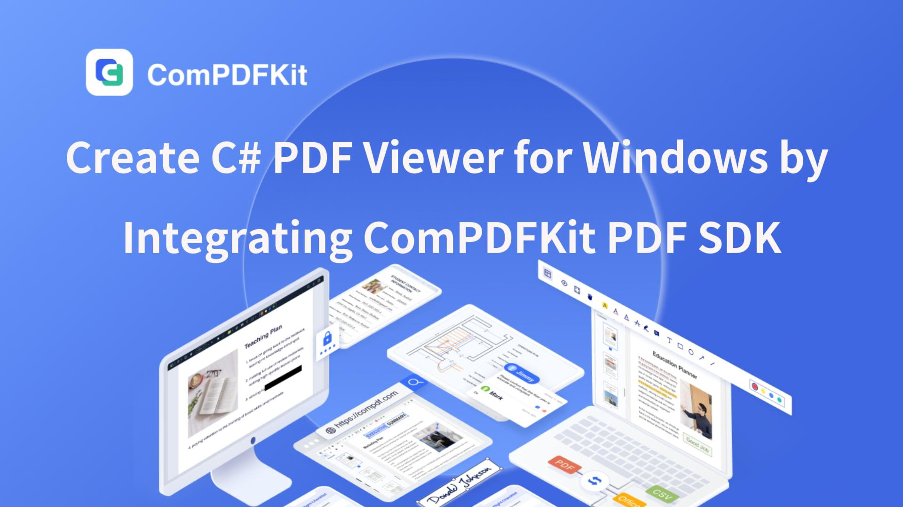
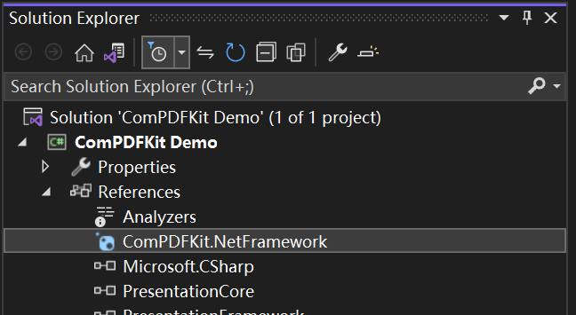

# Introduction
ComPDFKit PDF SDK for Windows developed and maintained by [ComPDF](https://www.compdf.com/) that allows developers to quickly add PDF Features to any Windows applications, elevating your Windows programs to ensure efficient development. It is available at [NuGet](https://www.nuget.org/packages/ComPDFKit.NetFramework) and github.com.

More Information can be found at: [https://www.compdf.com/guides/pdf-sdk/windows/overview](https://www.compdf.com/guides/pdf-sdk/windows/overview)

# Table of Content
- [Related](#related)
- [Requirements](#requirements)
- [How to Make a Windows Program in C#](#how-to-make-a-windows-program-in-c)
- [Supports](#support)
- [License ](#license)
- [Note](#note)

# Related

- [ComPDFKit PDF SDK for Windows Documentation Guide](https://www.compdf.com/guides/pdf-sdk/windows/overview)
- [ComPDF API Library for .Net](https://github.com/ComPDFKit/compdfkit-api-.net)
- Download [ComPDFKit PDF SDK for .NET](https://www.nuget.org/packages/ComPDFKit.NetFramework) in NuGet
- [How to Build a Windows PDF Viewer or Editor](https://www.compdf.com/blog/build-a-windows-pdf-viewer-or-editor)
- [Code Samples for Windows](https://www.compdf.com/guides/pdf-sdk/windows/examples) 
- [ComPDF API Reference](https://api.compdf.com/api-reference/overview)


# Requirements

- Windows 7, 8, 10, and 11 (32-bit and 64-bit).
- Visual Studio 2017 or higher (Make sure the **.NET Desktop Development** is installed).
- .NET Framework 4.5 or higher.

# How to Make a Windows Program in C#

## Video Guide: Create a C# PDF Viewer for Windows
[](https://youtu.be/HTFMhzE1Fu4?si=obeyvxldCbVVnHTY)


## Create a New Project


1. Open Visual Studio 2022, and click **Create a new project**.

   

2. Choose **WPF App (.NET Framework)** and click **Next**.

   


3. Configure your project: Set your project name and choose the location to store your program. The project name is called "ComPDFKit Demo" in this example. This sample project uses .NET Framework 4.6.1 as the programming framework.


4. Click the **Create** button. Then, the new project will be created.


## Add ComPDFKit to Your Project

There are two ways to add ComPDFKit to your Project: [Nuget Repository](https://www.nuget.org/packages/ComPDFKit.NetFramework) and Local Package, you can choose one or the other according to your needs.

**Nuget Repository**

1. Open your project's solution, and in the Solution Explorer, right-click on **References** and click on the menu item **Manage NuGet Packages**. This will open the NuGet Package Manager for your solution.


2. Go to [ComPDFKit.NetFramework](https://www.nuget.org/packages/ComPDFKit.NetFramework) in Nuget, and click on the **Install** button to install the package.


   

3. Once that is complete, you'll see a reference to the package in the Solution Explorer under **References**.

   


**Local Package**

Rather than targeting a package held at Nuget, you may set up a configuration to point to a local package. This can be useful for some situations, for example, your build machines don't have access to the internet.

1. You can find ***"ComPDFKit.NetFramework....nupkg"*** file in the [SDK Package](https://github.com/ComPDFKit/compdfkit-pdf-sdk-windows/tree/Tutorials-Blog/ComPDFKit%201.11.0%20for%20Windows/nuget)

2. Create or edit a ***"nuget.config"*** file in the same directory as your solution file (e.g. ***"ComPDFKit Demo.sln"***).


- The contents of the file should contain an XML element, _packageSources_ - which describes where to find NuGet packages - as a child of a root node named _configuration_. If the file already exists, add the extra _packageSources_ entry shown below. If the file is blank, copy and paste the entirety of the following contents:

```xml
<?xml version="1.0" encoding="utf-8"?>
<configuration>
    <packageSources>
        <add key="ComPDFKitSource" value="path\to\directoryContainingNupkg" />
    </packageSources>
</configuration>
```

- Edit the _value_ of the contents to correctly refer to the location of the directory containing the ***"ComPDFKit.NetFramework....nupkg"*** package - for example, C:\Users\me\nugetPackages\. Now save the file, and close and reopen your solution for Visual Studio to force a read of the NuGet configuration.

3. Open your project's solution, and in the Solution Explorer, right-click on **References** and click on the menu item **Manage NuGet Packages…**. This will open the NuGet Package Manager for your solution.

   

4. On the right-hand side of the manager in the Package source dropdown window, choose the entry _ComPDFKitSource_ (or whatever you decided to name it). You should then see the entry for ***"ComPDFKit.NetFramework"***.

   

5. On the right side, in the panel describing the package, click on the **Install** button to install the package.

   

6. Once that's complete, you'll see a reference to the package in the Solution Explorer under **References**.

   
   
## Apply the License Key

You can [contact the ComPDFKit team](https://www.compdf.com/contact-us) to obtain a trial license. Before using any classes from the ComPDFKit PDF SDK, you need to choose the corresponding scheme from the following two options based on the license type and apply the license to your application.

**Online Authentication**

You can perform online authentication using the following approach:

```c#
public static bool LicenseVerify()
{
	if (!CPDFSDKVerifier.LoadNativeLibrary())
	{ 
		return false;
	}
	LicenseErrorCode status = CPDFSDKVerifier.OnlineLicenseVerify("Input your license here.");
	return status == LicenseErrorCode.E_LICENSE_SUCCESS;
}
```

Additionally, if you need to confirm the communication status with the server during online authentication, you can implement the `CPDFSDKVerifier.LicenseRefreshed` callback:

```C#
CPDFSDKVerifier.LicenseRefreshed += CPDFSDKVerifier_LicenseRefreshed;

private void CPDFSDKVerifier_LicenseRefreshed(object sender, ResponseModel e)
{
    if(e != null)
    {
        string message = string.Format("{0} {1}", e.Code, e.Message);
        Trace.WriteLine(message);
    }
    else
    {
        Trace.WriteLine("Network not connected."); 
    } 
}

```

**Offline Authentication** 

The following is the `LicenseVerify()` method for implementing offline authentication:

```c#
bool LicenseVerify()
{
    if (!CPDFSDKVerifier.LoadNativeLibrary())
        return false;

    LicenseErrorCode verifyResult = CPDFSDKVerifier.LicenseVerify("Input your license here.", false);
    return (verifyResult == LicenseErrorCode.E_LICENSE_SUCCESS);
}
```

## Display a PDF Document

We have finished all prepare steps. Let's display a PDF file.

1. Add the following code to ***"MainWindow.xaml"*** and ***"MainWindow.xaml.cs"*** to display a PDF document. Please make sure to replace "ComPDFKit_Demo" with the name of your project. Now, all you need to do is to create a `CPDFViewer` object, and then display the `CPDFViewer` object in the Grid (component) named "PDFGrid" using the `OpenPDF_Click` method.

2. Now your ***"MainWindow.xaml"*** should look like the following code.

```c#
<Window x:Class="ComPDFKit_Demo.MainWindow"
        xmlns="http://schemas.microsoft.com/winfx/2006/xaml/presentation"
        xmlns:x="http://schemas.microsoft.com/winfx/2006/xaml"
        xmlns:d="http://schemas.microsoft.com/expression/blend/2008"
        xmlns:mc="http://schemas.openxmlformats.org/markup-compatibility/2006"
        xmlns:local="clr-namespace:ComPDFKit_Demo"
        xmlns:compdfkitviewer="clr-namespace:ComPDFKitViewer;assembly=ComPDFKit.Viewer"
        mc:Ignorable="d"
        Focusable="True"
        Title="MainWindow" Height="600" Width="800" UseLayoutRounding="True">
    <Grid>
        <Grid.RowDefinitions>
            <RowDefinition Height="*"/>
            <RowDefinition Height="52"/>
        </Grid.RowDefinitions>
        <Grid Name="PDFGrid" Grid.Row="0">
            <ScrollViewer Focusable="False" CanContentScroll="True" HorizontalScrollBarVisibility="Auto" VerticalScrollBarVisibility="Auto">
                <compdfkitviewer:CPDFViewer x:Name="PDFViewer"/>
            </ScrollViewer>
        </Grid>
        <Button Content="Open PDF" Grid.Row="1" HorizontalAlignment="Left" Margin="10" Click="OpenPDF_Click"/>
    </Grid>
</Window>
```

3. Now your ***“MainWindow.xaml.cs”*** should look like the following code. Please note: You need to enter your license key. All the places that need to be modified in the code have been marked with comments in the code below. You just need to replace the string content below the comments by yourself.

```c#
using ComPDFKit.NativeMethod;
using ComPDFKit.PDFDocument;
using Microsoft.Win32;
using System.Windows;

namespace ComPDFKit_Demo
{
    public partial class MainWindow : Window
    {
        public MainWindow()
        {
            InitializeComponent();
            LicenseVerify();
        }

        bool LicenseVerify()
        {
            if (!CPDFSDKVerifier.LoadNativeLibrary())
                return false;

            // Input your license.
            LicenseErrorCode verifyResult = CPDFSDKVerifier.LicenseVerify("Input your license here.");
            return (verifyResult == LicenseErrorCode.E_LICENSE_SUCCESS);
        }

        private void OpenPDF_Click(object sender, RoutedEventArgs e)
        {
            // Get the path of a PDF file.
            var dlg = new OpenFileDialog();
            dlg.Filter = "PDF Files (*.pdf)|*.pdf";
            if (dlg.ShowDialog() == true)
            {
                // Use the PDF file path to open the document in CPDFViewer.
                CPDFDocument doc = CPDFDocument.InitWithFilePath(dlg.FileName);
                if (doc != null && doc.ErrorType == CPDFDocumentError.CPDFDocumentErrorSuccess)
                    PDFViewer.InitDoc(doc);
            }
        }
    }
}
```

4. Now run the project and you will see the PDF file that you want to display.  The PDF Viewer has been created successfully.


## Troubleshooting

1. License Verification Failed
- If "System.IO.FileNotFoundException" occurred in the `LicenseVerify()` function like this:


- Check your WPF project and ensure that you chose **WPF App(.NET Framework)** instead of **WPF Application** when creating the project.


2. Other Problems

   If you meet some other problems when integrating our ComPDFKit PDF SDK for Windows, feel free to contact [our support team](https://www.compdf.com/support).


# Support

ComPDF offers professional technical support and 5*24 responsive service.

- For detailed information, please visit our [Guides](https://www.compdf.com/guides/pdf-sdk/windows/overview) page.

- Stay updated with the latest improvements through our [Changelog](https://www.compdf.com/pdf-sdk/changelog-windows).

- For technical assistance, please reach out to our [Technical Support](https://www.compdf.com/support).

- To get more details and an accurate quote, please contact our [Sales Team](https://compdf.com/contact-us) or [Send an Email](mailto:support@compdf.com) to us.


# License

ComPDF offers developers a [30-day free trial license](https://www.compdf.com/pricing) for free testing your Windows projects. Additionally, you'll have access to a fully-featured product with no limitations on file or user count.  

# Note

We are glad to announce that you can register a ComPDFKit API account for a [free trial](https://api.compdf.com/api/pricing) to process 1000 documents per month for free.

