# ComPDF SDK for Windows (.NET PDF Library)

[ComPDF SDK for Windows](https://www.compdf.com/?utm_source=github&utm_medium=compdfkit-pdf-sdk-windows&utm_campaign=compdfkit_pdf_sdk_windows_repo&ref_platform_id=github_compdfkit) (Part of the KDAN ecosystem) enables developers to quickly and seamlessly integrate advanced PDF functionalities—such as viewing, editing, annotating, filling forms, and signing — into Windows applications.

The ComPDF Windows PDF Library provides an easy-to-use .NET API that helps teams ship PDF features faster without complex integrations. You can start with a [30-day free trial license](https://www.compdf.com/contact-sales?utm_source=github&utm_medium=compdfkit-pdf-sdk-windows&utm_campaign=compdfkit_pdf_sdk_windows_repo&ref_platform_id=github_compdfkit) and evaluate the SDK in your own Windows project.

> If you find ComPDF SDK useful, please consider giving us a ⭐ **Star** on GitHub — it helps us grow and improve. Got questions or ideas? Join the conversation in our [Discussions](https://github.com/ComPDFKit/compdfkit-pdf-sdk-windows/discussions).


**Why ComPDF SDK for Windows?**

* **Easy to Integrate:** Integrate PDF functionalities easily with our powerful SDK and clear documentation and guides with few lines of code.
  
* **Fully Customizable UI:** Design a unique interface for your products with fully customizable UI source code by a high-performing SDK.
  
* **[Comprehensive PDF Features:](https://www.compdf.com/pdf-sdk/features-list?utm_source=github&utm_medium=compdfkit-pdf-sdk-windows&utm_campaign=compdfkit_pdf_sdk_windows_repo&ref_platform_id=github_compdfkit)** Supports generation, viewing, annotation, page editing, content editing, conversion, OCR, redaction, signing, forms, parsing, measurement, compression, comparison, color separation, batch processing, and more.
  
* **Faster Time-to-Market:** Comprehensive SDK libraries save your time and expenses and roll out your applications and projects.
  
* **High-quality Service:** We provide 24/7 professional one-to-one technical support, including onsite service and remote assistance via phone and email.
  

## Table of Contents

- [Supported Features](#supported-features)
- [Preview](#preview)
- [Requirements](#requirements)
- [How to Make a Windows Program in C#](#how-to-make-a-windows-program-in-c)
  - [Video Guide](#video-guide)
  - [Create a New Project](#create-a-new-project)
  - [Installation](#install)
  - [Apply the License Key](#apply-the-license-key)
  - [Display a PDF Document](#display-a-pdf-document)
  - [Troubleshooting](#troubleshooting)
- [Free Trial and License](#free-trial-and-license)
- [Support](#support)
- [Changelog](#changelog)
- [Related](#related)

## Supported Features

**Viewer**: Fast and smooth PDF rendering and viewing

* Display Modes - single/double page, vertical & horizontal scrolling, cover mode, crop mode
* Text Search & Selection
* PDF Navigation - outlines, bookmarks

**Annotations**:

- Notes - add longer comments with adjustable icon shape and color
* Ink - freehand drawing with customizable color, opacity, line thickness
* Text - add, move, resize text directly on page
* Inspector - adjust annotation looks (line styles, borders, colors, opacity, font)
* Comment on Annotations and Update Status
* Import & Export & Flatten Annotations (XFDF, FDF, JSON)
* Highlight, Underline, Strikeout, Squiggly
* Shapes - Rectangle, Oval, Line, Arrow, Polygon, Polyline, Cloud
* Stamps, Sound, Movie, File Attachment, Link, Distance, Perimeter, Area

**Forms**:

* Process fillable and static PDF forms

* Form filling, form creation, form flattening

**Document Editor**: 

- Page manipulation - insert, delete, rotate, reorder, extract, crop

- Split PDF, Merge PDF

**Content Editor**: Edit PDF text and images directly like in Word

**Security**:

* Encryption - set open password, permission password

* Restrict printing, copying, editing

**Signatures**:

* Electronic Signatures - draw, type, image signatures

* Digital Signatures - certificate-based signature validation

**Watermark:** 

- Add Text or Image Watermarks

- Delete Watermarks

- Customize Watermarks

**OCR:**

- AI OCR

- Recognize Tables, Graphics, Images

- Support recognition in 80+ Languages

**Compare Documents**: Side-by-side document comparison to highlight differences

**Redaction**: Permanently remove sensitive content from PDFs

**Measurement**: Distance, area, perimeter measurement tools

**Compress**: Optimize and reduce PDF file size

**PDF/A, PDF/X, PDF/E, PDF/UA**: Standards compliance for archiving, printing, engineering, and accessibility

**Convert Files**: 

- Convert PDF to Word, Excel, PPT, HTML, CSV, images (PNG,JPEG, JPEG, JPEG2000, BMP, TIFF, TGA, GIF), RTF, TXT, JSON, XML, markdown, searchable PDF, searchable OFD.

- Convert images (PNG,JPEG, JPEG, JPEG2000, BMP, TIFF, TGA, GIF) to Word, Excel, PPT, HTML, CSV, RTF, TXT, JSON, XML.

- Convert Word, Excel, PPT, HTML, CSV, PNG, RTF, TXT to PDF

**UI Customization**:

- Toolbar Customization

- UI Personalization

- Ready-Made UI Options

- Out-of-the-box Source Code

## Preview

ComPDF SDK for Windows delivers a smooth, feature-rich PDF experience for desktop applications.


## Requirements

Before starting, please make sure that you have already met the following prerequisites.

### Get a ComPDF License Key

ComPDF provides two types of license key: a **30-day free trial license** and a **formal license**.

#### How to Get a Free Trial License

- **Method 1: Apply Online**

If you want to get PDF SDK trials for **Web, Windows, Android, iOS, Flutter, and React Native**, simply apply for a [30-day free trial license](https://www.compdf.com/contact-sales?utm_source=github&utm_medium=compdfkit-pdf-sdk-windows&utm_campaign=compdfkit_pdf_sdk_windows_repo&ref_platform_id=github_compdfkit) online.

You can check features supported by the free trial license on our [Pricing page](https://www.compdf.com/pricing?utm_source=github&utm_medium=compdfkit-pdf-sdk-windows&utm_campaign=compdfkit_pdf_sdk_windows_repo&ref_platform_id=github_compdfkit).

- **Method 2: Contact Sales**

For other platforms or features outside of the trial license, feel free to [contact our sales team](https://www.compdf.com/contact-sales?utm_source=github&utm_medium=compdfkit-pdf-sdk-windows&utm_campaign=compdfkit_pdf_sdk_windows_repo&ref_platform_id=github_compdfkit).

#### How to Get a Formal License

ComPDF SDK is a commercial SDK that requires a license for application release. Any documents, sample code, or source code distribution from the released package of ComPDF to any third party is prohibited.

To get formal licenses for Windows platforms, advanced features, custom requirements, or quote inquiries, feel free to [contact our sales team](https://www.compdf.com/contact-sales?utm_source=github&utm_medium=compdfkit-pdf-sdk-windows&utm_campaign=compdfkit_pdf_sdk_windows_repo&ref_platform_id=github_compdfkit).

For the Windows PDF SDK, the formal license must be bound to your developer device ID ([How to find the developer device ID](https://www.compdf.com/faq/how-to-find-the-device-id?utm_source=github&utm_medium=compdfkit-pdf-sdk-windows&utm_campaign=compdfkit_pdf_sdk_windows_repo&ref_platform_id=github_compdfkit)), and each license is only valid for one device ID in development mode.

### Download the PDF SDK

Download the ComPDF SDK for Windows on [GitHub](https://github.com/ComPDFKit/compdfkit-pdf-sdk-windows) or [NuGet](https://www.nuget.org/packages/ComPDFKit.NetFramework).

### System Requirements

| Item             | Requirement                                                                        |
| ---------------- | ---------------------------------------------------------------------------------- |
| Operating System | Windows 7, 8, 10, and 11 (32-bit and 64-bit)                                       |
| IDE              | Visual Studio 2017 or higher (make sure **.NET Desktop Development** is installed) |
| Framework        | .NET Framework 4.5 or higher                                                       |

## How to Make a Windows Program in C#

This section will help you quickly get started with ComPDF SDK to build a Windows app in C# with step-by-step instructions. Through the following steps, you will get a simple application that can display the contents of a specified PDF file.

### Video Guide: Create a C# PDF Viewer for Windows

[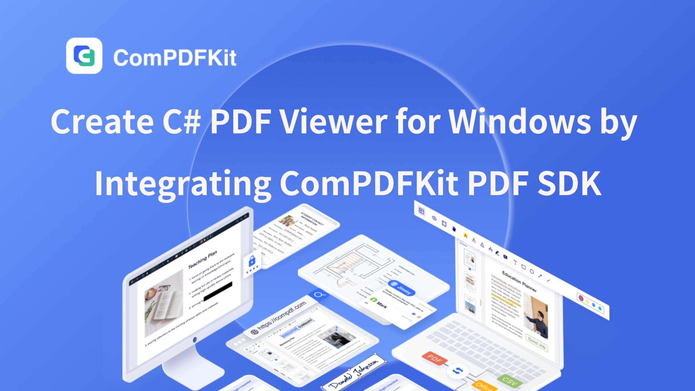](https://youtu.be/HTFMhzE1Fu4?si=obeyvxldCbVVnHTY)

### Create a New Project

1. Open Visual Studio 2022, and click **Create a new project**.
   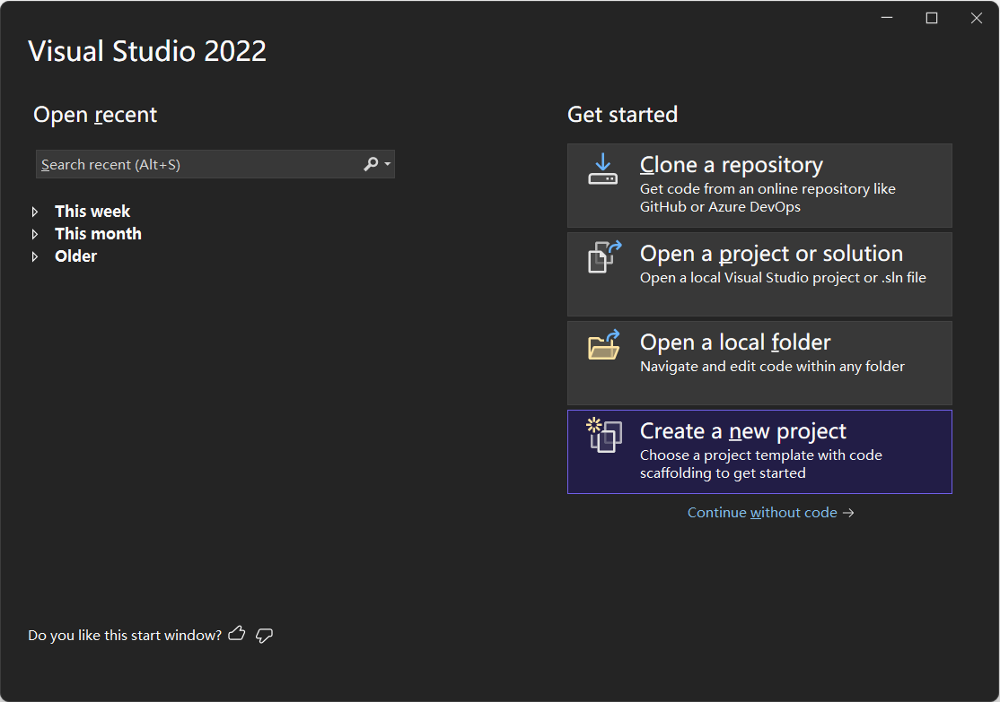

2. Choose **WPF App (.NET Framework)** and click **Next**.
   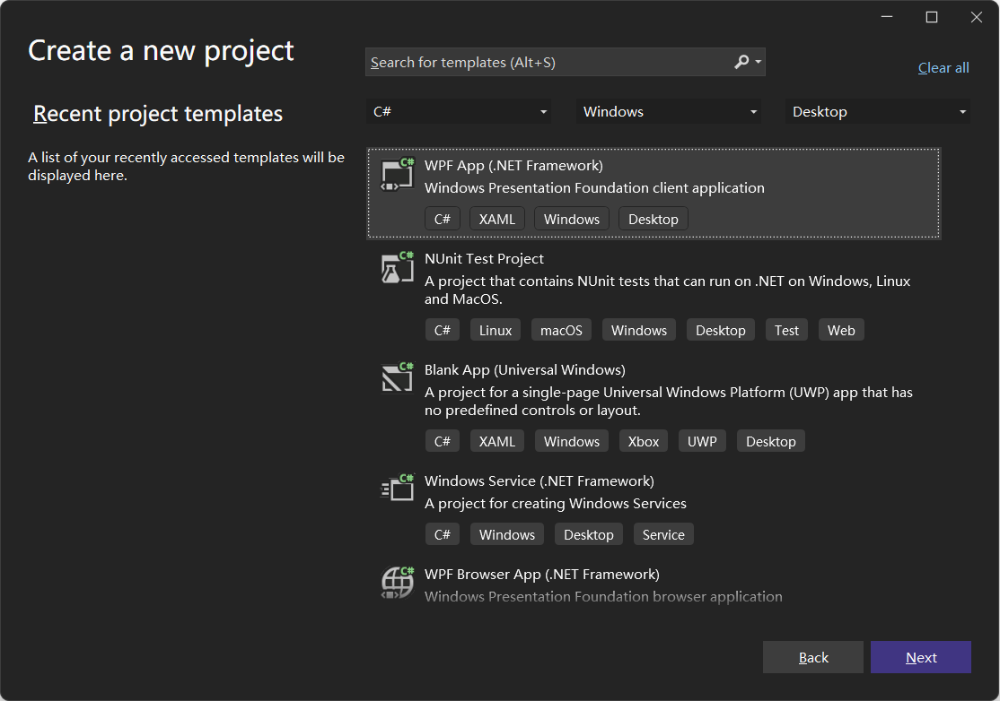

3. Configure your project: Set your project name and choose the location to store your program. The project name is called "ComPDF Demo" in this example. This sample project uses .NET Framework 4.6.1 as the programming framework.

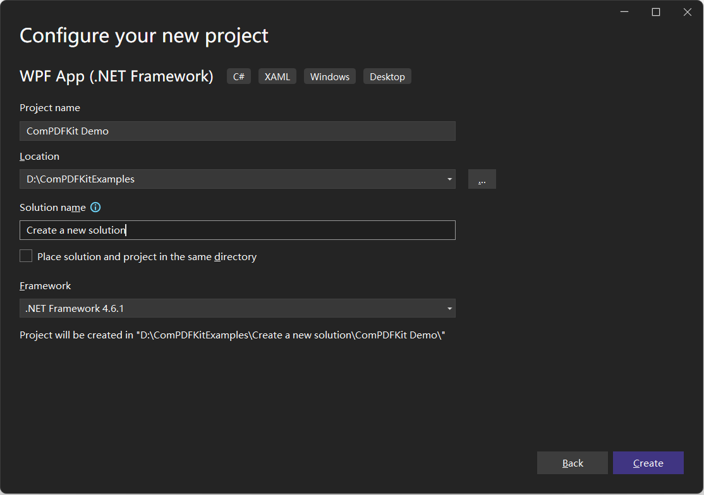

4. Click the **Create** button. Then, the new project will be created.

### Install

There are two ways to add ComPDF to your Project: [Nuget Repository](https://www.nuget.org/packages/ComPDFKit.NetFramework) and Local Package, you can choose one or the other according to your needs.

**Nuget Repository**

1. Open your project's solution, and in the Solution Explorer, right-click on **References** and click on the menu item **Manage NuGet Packages**. This will open the NuGet Package Manager for your solution.

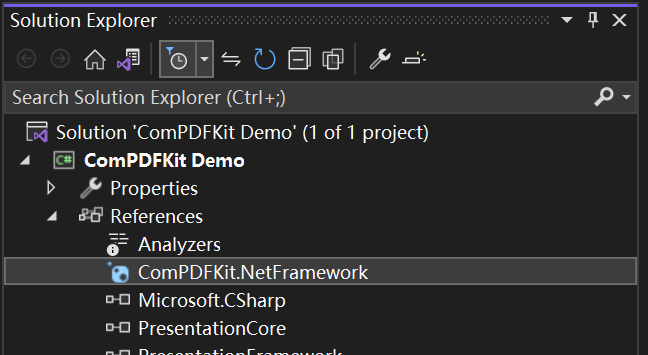

2. Go to [ComPDF.NetFramework](https://www.nuget.org/packages/ComPDFKit.NetFramework) in Nuget, and click on the **Install** button to install the package.

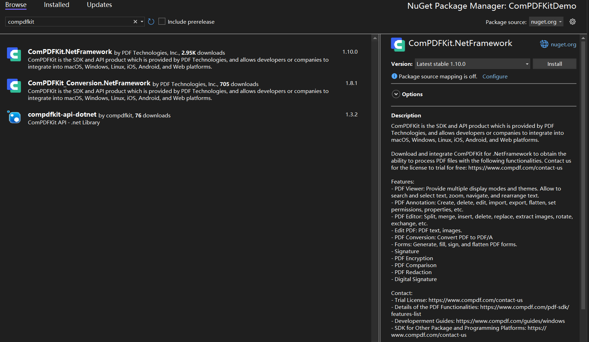

3. Once that is complete, you'll see a reference to the package in the Solution Explorer under **References**.
   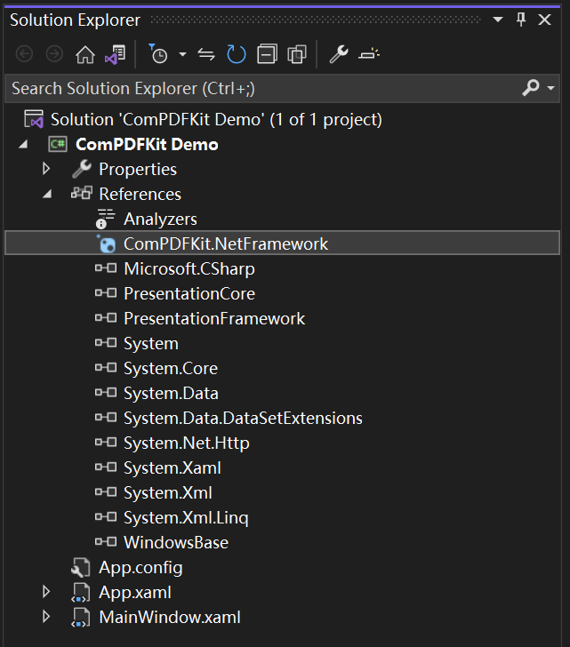

**Local Package**

Rather than targeting a package held at Nuget, you may set up a configuration to point to a local package. This can be useful for some situations, for example, your build machines don't have access to the internet.

1. You can find ***"ComPDF.NetFramework....nupkg"*** file in the [SDK Package](https://github.com/ComPDFKit/compdfkit-pdf-sdk-windows/tree/Tutorials-Blog/ComPDFKit%201.11.0%20for%20Windows/nuget)

2. Create or edit a ***"nuget.config"*** file in the same directory as your solution file (e.g. ***"ComPDF Demo.sln"***).

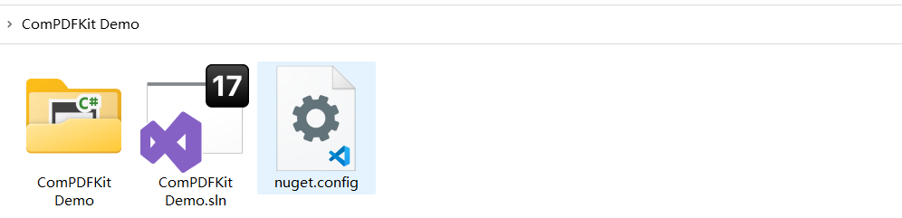

- The contents of the file should contain an XML element, _packageSources_ - which describes where to find NuGet packages - as a child of a root node named _configuration_. If the file already exists, add the extra _packageSources_ entry shown below. If the file is blank, copy and paste the entirety of the following contents:

```xml
<?xml version="1.0" encoding="utf-8"?>
<configuration>
    <packageSources>
        <add key="ComPDFKitSource" value="path\to\directoryContainingNupkg" />
    </packageSources>
</configuration>
```

- Edit the _value_ of the contents to correctly refer to the location of the directory containing the ***"ComPDF.NetFramework....nupkg"*** package - for example, C:\Users\me\nugetPackages\. Now save the file, and close and reopen your solution for Visual Studio to force a read of the NuGet configuration.
3. Open your project's solution, and in the Solution Explorer, right-click on **References** and click on the menu item **Manage NuGet Packages…**. This will open the NuGet Package Manager for your solution.
   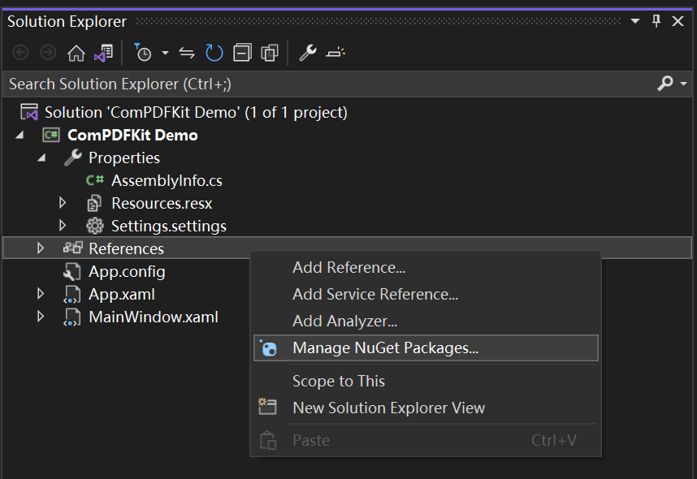

4. On the right-hand side of the manager in the Package source dropdown window, choose the entry _ComPDFKitSource_ (or whatever you decided to name it). You should then see the entry for ***"ComPDF.NetFramework"***.
   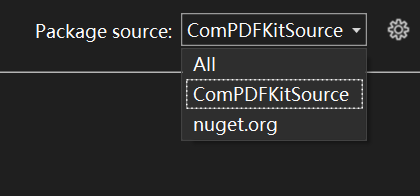

5. On the right side, in the panel describing the package, click on the **Install** button to install the package.
   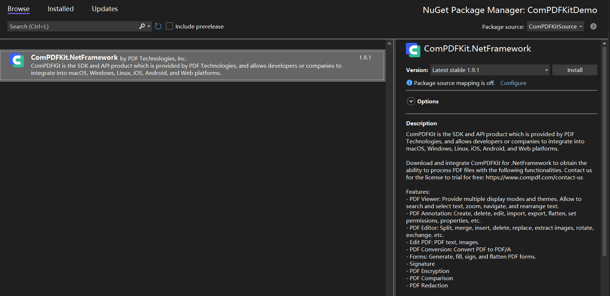

6. Once that's complete, you'll see a reference to the package in the Solution Explorer under **References**.
   

### Apply the License Key

If you haven't get a license key, please check out [how to obtain a license key](###Get ComPDFKit License Key).

ComPDFKit PDF SDK currently supports two authentication methods to verify license keys: online authentication and offline authentication.

_Learn about:_

* [_What is the authentication mechanism of ComPDFKit's license?_](https://www.compdf.com/faq/authentication-mechanism-of-compdfkit-license?utm_source=github&utm_medium=compdfkit-pdf-sdk-windows&utm_campaign=compdfkit_pdf_sdk_windows_repo&ref_platform_id=github_compdfkit)
  
* [_What are the differences between Online Authentication and Offline Authentication?_](https://www.compdf.com/faq/the-differences-between-online-authentication-and-offline-authentication?utm_source=github&utm_medium=compdfkit-pdf-sdk-windows&utm_campaign=compdfkit_pdf_sdk_windows_repo&ref_platform_id=github_compdfkit)

#### Copy the License Key

After getting the license key, follow the steps below to apply it to your project.

1. In the email you received, locate the `XML` file containing the license key.

2. Copy the license key `XML` file to your own project.

#### Apply the License Key

You can perform authentication using the following method:

```C#
public static bool LicenseVerify()
{
    if (!CPDFSDKVerifier.LoadNativeLibrary())
    { 
        return false;
    }
    string xmlPath = "The path to your license key XML file";
    LicenseErrorCode status = CPDFSDKVerifier.LicenseVerify(xmlPath);
    return status == LicenseErrorCode.E_LICENSE_SUCCESS;
}
```

### Display a PDF Document

We have finished all prepare steps. Let's display a PDF file.

1. Add the following code to ***"MainWindow.xaml"*** and ***"MainWindow.xaml.cs"*** to display a PDF document. Please make sure to replace "ComPDFKit_Demo" with the name of your project. Now, all you need to do is to create a `CPDFViewer` object, and then display the `CPDFViewer` object in the Grid (component) named "PDFGrid" using the `OpenPDF_Click` method.

2. Now your ***"MainWindow.xaml"*** should look like the following code.

```c#
<Window x:Class="ComPDFKit_Demo.MainWindow"
        xmlns="http://schemas.microsoft.com/winfx/2006/xaml/presentation"
        xmlns:x="http://schemas.microsoft.com/winfx/2006/xaml"
        xmlns:d="http://schemas.microsoft.com/expression/blend/2008"
        xmlns:mc="http://schemas.openxmlformats.org/markup-compatibility/2006"
        xmlns:local="clr-namespace:ComPDFKit_Demo"
        xmlns:compdfkitviewer="clr-namespace:ComPDFKitViewer;assembly=ComPDFKit.Viewer"
        mc:Ignorable="d"
        Focusable="True"
        Title="MainWindow" Height="600" Width="800" UseLayoutRounding="True">
    <Grid>
        <Grid.RowDefinitions>
            <RowDefinition Height="*"/>
            <RowDefinition Height="52"/>
        </Grid.RowDefinitions>
        <Grid Name="PDFGrid" Grid.Row="0">
            <ScrollViewer Focusable="False" CanContentScroll="True" HorizontalScrollBarVisibility="Auto" VerticalScrollBarVisibility="Auto">
                <compdfkitviewer:CPDFViewer x:Name="PDFViewer"/>
            </ScrollViewer>
        </Grid>
        <Button Content="Open PDF" Grid.Row="1" HorizontalAlignment="Left" Margin="10" Click="OpenPDF_Click"/>
    </Grid>
</Window>
```

3. Now your ***“MainWindow.xaml.cs”*** should look like the following code. Please note: You need to enter your license key. All the places that need to be modified in the code have been marked with comments in the code below. You just need to replace the string content below the comments by yourself.

```c#
using ComPDFKit.NativeMethod;
using ComPDFKit.PDFDocument;
using Microsoft.Win32;
using System.Windows;

namespace ComPDFKit_Demo
{
    public partial class MainWindow : Window
    {
        public MainWindow()
        {
            InitializeComponent();
            LicenseVerify();
        }

        bool LicenseVerify()
        {
            if (!CPDFSDKVerifier.LoadNativeLibrary())
                return false;

            // Input your license.
            LicenseErrorCode verifyResult = CPDFSDKVerifier.LicenseVerify("Input your license here.");
            return (verifyResult == LicenseErrorCode.E_LICENSE_SUCCESS);
        }

        private void OpenPDF_Click(object sender, RoutedEventArgs e)
        {
            // Get the path of a PDF file.
            var dlg = new OpenFileDialog();
            dlg.Filter = "PDF Files (*.pdf)|*.pdf";
            if (dlg.ShowDialog() == true)
            {
                // Use the PDF file path to open the document in CPDFViewer.
                CPDFDocument doc = CPDFDocument.InitWithFilePath(dlg.FileName);
                if (doc != null && doc.ErrorType == CPDFDocumentError.CPDFDocumentErrorSuccess)
                    PDFViewer.InitDoc(doc);
            }
        }
    }
}
```

4. Now run the project and you will see the PDF file that you want to display.  The PDF Viewer has been created successfully.

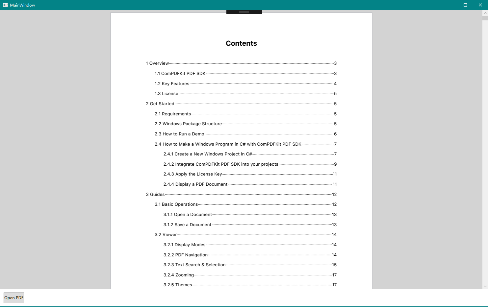

### Troubleshooting

1. License Verification Failed
- If "System.IO.FileNotFoundException" occurred in the `LicenseVerify()` function like this:

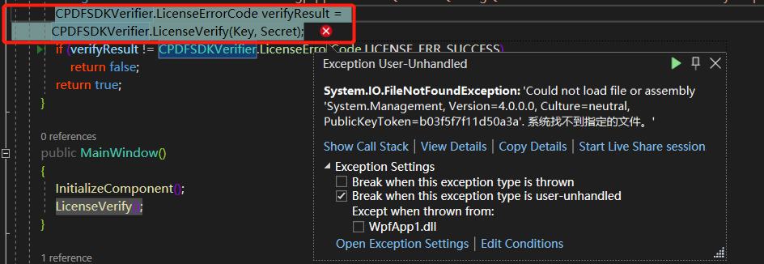

- Check your WPF project and ensure that you chose **WPF App(.NET Framework)** instead of **WPF Application** when creating the project.

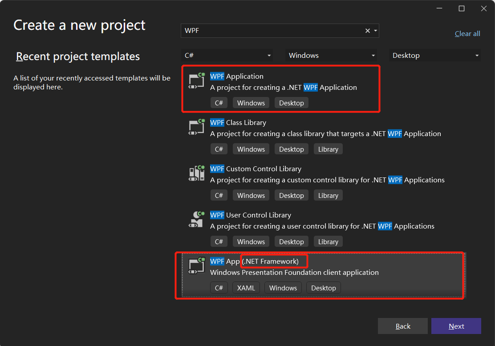

2. Other Problems
   If you encounter other integration issues while using ComPDF SDK for Windows, feel free to contact [our support team](https://www.compdf.com/support?utm_source=github&utm_medium=compdfkit-pdf-sdk-windows&utm_campaign=compdfkit_pdf_sdk_windows_repo&ref_platform_id=github_compdfkit).


## Free Trial and License

[ComPDF SDK for Windows](https://www.compdf.com/?utm_source=github&utm_medium=compdfkit-pdf-sdk-windows&utm_campaign=compdfkit_pdf_sdk_windows_repo&ref_platform_id=github_compdfkit) offers a **30-day free trial license** so you can evaluate all core PDF capabilities in your own application.

To get started:

1. Apply for a [30-day free trial license](https://www.compdf.com/contact-sales?utm_source=github&utm_medium=compdfkit-pdf-sdk-windows&utm_campaign=compdfkit_pdf_sdk_windows_repo&ref_platform_id=github_compdfkit)
2. Review supported trial features on the [Pricing page](https://www.compdf.com/pricing?utm_source=github&utm_medium=compdfkit-pdf-sdk-windows&utm_campaign=compdfkit_pdf_sdk_windows_repo&ref_platform_id=github_compdfkit)
3. Follow the [Apply the License Key](#apply-the-license-key) steps above to activate the SDK in your project

For custom deployments, advanced features, or volume licensing, please [contact our sales team](https://www.compdf.com/contact-sales?utm_source=github&utm_medium=compdfkit-pdf-sdk-windows&utm_campaign=compdfkit_pdf_sdk_windows_repo&ref_platform_id=github_compdfkit)

## Support

ComPDF offers professional technical support and 5×24 responsive service.

* For detailed information, please visit our [Guides](https://www.compdf.com/guides/pdf-sdk/windows/overview?utm_source=github&utm_medium=compdfkit-pdf-sdk-windows&utm_campaign=compdfkit_pdf_sdk_windows_repo&ref_platform_id=github_compdfkit) page.
* For technical assistance, please reach out to our [Technical Support](https://www.compdf.com/support?utm_source=github&utm_medium=compdfkit-pdf-sdk-windows&utm_campaign=compdfkit_pdf_sdk_windows_repo&ref_platform_id=github_compdfkit).
* To get more details and an accurate quote, please contact our [Sales Team](https://www.compdf.com/contact-sales?utm_source=github&utm_medium=compdfkit-pdf-sdk-windows&utm_campaign=compdfkit_pdf_sdk_windows_repo&ref_platform_id=github_compdfkit) or [send an email](mailto:support@compdf.com).


## Changelog

Keep up with the latest updates, improvements, and bug fixes for ComPDF SDK for Windows: [View Windows Changelog](https://www.compdf.com/pdf-sdk/changelog-windows?utm_source=github&utm_medium=compdfkit-pdf-sdk-windows&utm_campaign=compdfkit_pdf_sdk_windows_repo&ref_platform_id=github_compdfkit).

## Related

* Detailed Guides:
  
  - [Documentation Guides](https://www.compdf.com/guides/pdf-sdk/windows/overview?utm_source=github&utm_medium=compdfkit-pdf-sdk-windows&utm_campaign=compdfkit_pdf_sdk_windows_repo&ref_platform_id=github_compdfkit)
  
  - [Code Samples for Windows](https://www.compdf.com/guides/pdf-sdk/windows/examples?utm_source=github&utm_medium=compdfkit-pdf-sdk-windows&utm_campaign=compdfkit_pdf_sdk_windows_repo&ref_platform_id=github_compdfkit)
  
  - [ComPDF API Reference](https://api.compdf.com/api-reference/overview?utm_source=github&utm_medium=compdfkit-pdf-sdk-windows&utm_campaign=compdfkit_pdf_sdk_windows_repo&ref_platform_id=github_compdfkit)

* [Steps to Build a Windows PDF Viewer or Editor](https://www.compdf.com/blog/build-a-windows-pdf-viewer-or-editor?utm_source=github&utm_medium=compdfkit-pdf-sdk-windows&utm_campaign=compdfkit_pdf_sdk_windows_repo&ref_platform_id=github_compdfkit)

* [More platforms and frameworks](https://www.compdf.com/documentation?utm_source=github&utm_medium=compdfkit-pdf-sdk-windows&utm_campaign=compdfkit_pdf_sdk_windows_repo&ref_platform_id=github_compdfkit)

